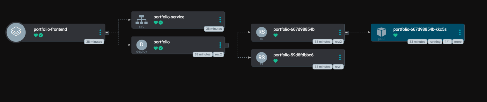

# ArgoCD Projects Feature — GitOps Setup

> 📌 **Projects = A dedicated workspace in ArgoCD that groups and secures your applications.**
> Create the project first, deploy the app inside it — ArgoCD handles the rest.

```
📝 Write YAML  →  ⬆️ Push to Git  →  👁️ ArgoCD watches  →  ✅ Cluster matches Git
```

---

## 📁 Repository Structure

```
argocd-gitops/
├── argo-features/
│   └── projects/
│       ├── project.yml
│       └── portfolio_app.yml
└── practicals/
    └── portfolio-manifest/
        ├── deployment.yml
        └── service.yml
```

---

## 🔄 How the Flow Works

```
project.yml
    └── Creates the ArgoCD Project workspace (boundary & permissions)
            |
            v
portfolio_app.yml
    └── Deploys the application INSIDE that project
    └── Points ArgoCD to practicals/portfolio-manifest/
            |
            v
deployment.yml + service.yml
    └── ArgoCD syncs these to the cluster
            |
            v
Service → Deployment → ReplicaSet → Pod ✅
```

---

## 📸 ArgoCD Application View



> The above shows the live resource tree in ArgoCD after sync:
> `portfolio-frontend` → `portfolio-service` (svc) + `portfolio` (deploy) → ReplicaSets → Running Pod

---

## 🚀 Setup

### 1. Apply the Project

Creates the ArgoCD project workspace with scoped permissions:

```bash
kubectl apply -f argo-features/projects/project.yml
```

### 2. Deploy the Application into the Project

Registers the portfolio app inside the project — ArgoCD points to `portfolio-manifest/` and begins watching:

```bash
kubectl apply -f argo-features/projects/portfolio_app.yml
```

### 3. Sync the Application

ArgoCD reads `deployment.yml` and `service.yml` and applies them to the cluster:

```bash
argocd app sync portfolio-app
```

### 4. Verify the Deployment

```bash
kubectl get pods
kubectl get svc
```

### 5. Access the Application

```bash
kubectl port-forward svc/portfolio-service 8082:80
```

Open `http://localhost:8082`

> **On EC2?** Use `http://<EC2-PUBLIC-IP>:8082` and open port `8082` in your Security Group inbound rules.

---

## 🧪 Testing GitOps

### Self-Healing Test

Delete a pod manually — ArgoCD restores it automatically:

```bash
kubectl delete pod <pod-name>
kubectl get pods
```

### Drift Detection Test

Delete the Deployment — ArgoCD recreates it from Git:

```bash
kubectl delete deployment portfolio
kubectl get deployment
```

> Git is the single source of truth. Any drift from it gets auto-corrected.
