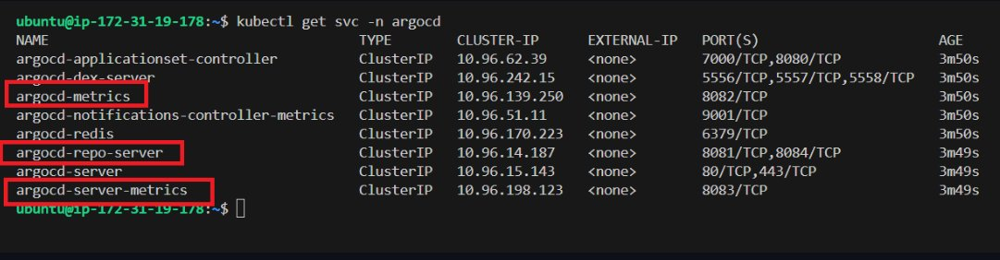
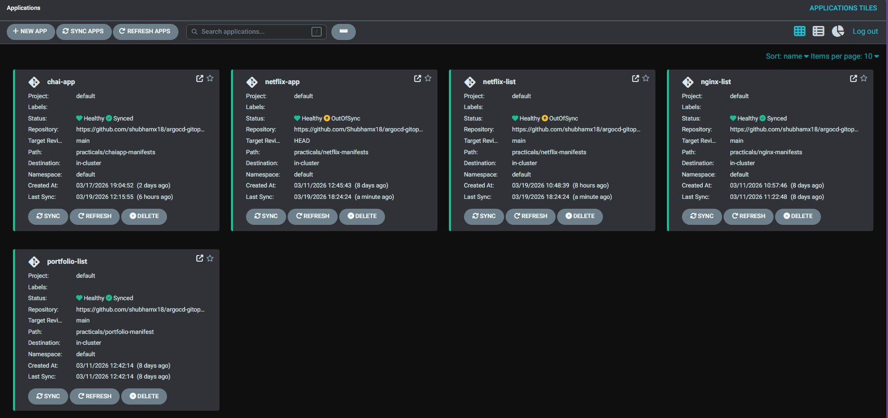
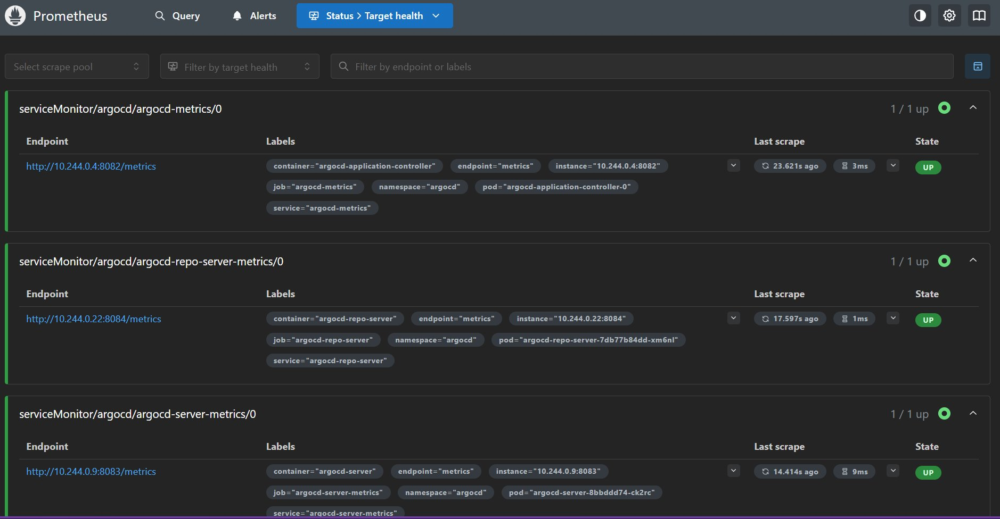
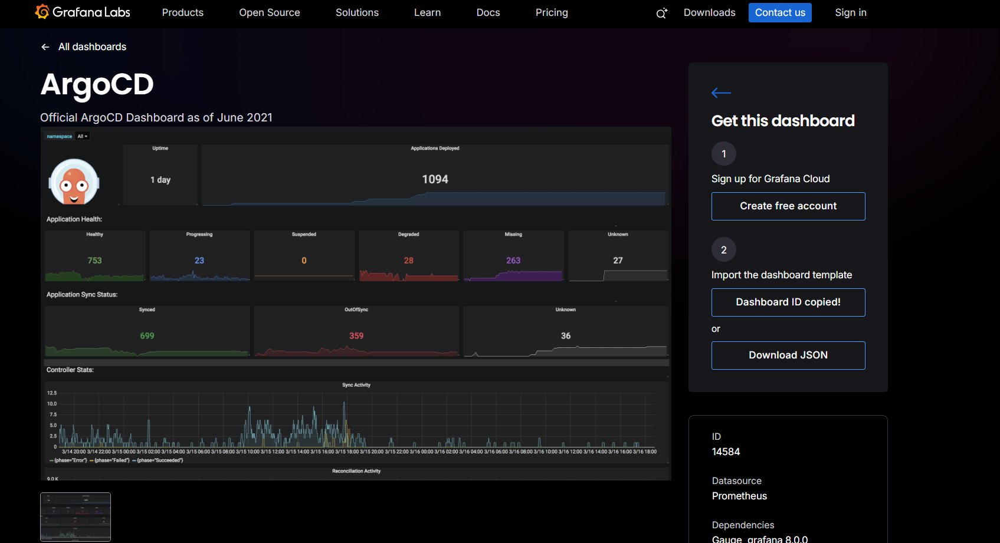
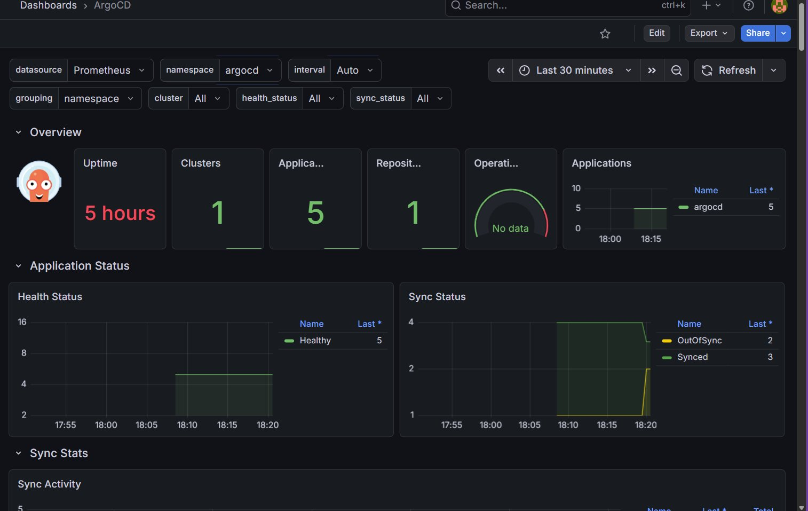

# Chapter 8 - Monitoring ArgoCD

Monitor your ArgoCD applications using Prometheus and Grafana — real-time visibility into sync status, health, and performance without touching a single config file manually.

**Apps we are monitoring:**
`chai-app` · `netflix-app` · `nginx-list` · `portfolio-list` · `netflix-list`

---

## Architecture

```
ArgoCD Apps
    │
    ▼
ArgoCD Metrics Endpoints
  ├── argocd-metrics          :8082  (Application Controller)
  ├── argocd-server-metrics   :8083  (API Server)
  └── argocd-repo-server      :8084  (Repo Server)
    │
    ▼
Prometheus  ←  ServiceMonitors (tell Prometheus what to scrape)
    │
    ▼
Grafana Dashboards
  ├── ID: 14584  (ArgoCD Overview)
  └── ID: 19993  (ArgoCD Operational)
```

---

## Prerequisites

- Kind cluster running
- ArgoCD installed via **official manifests** (not Helm)
- `kubectl` configured
- ArgoCD CLI installed and logged in
- Helm 3.x installed

> ArgoCD **must** be installed using the official manifests. Only then does it create the three metrics services needed for Prometheus to scrape. Helm-based ArgoCD install does not create them.

---

## Step 1 — Verify ArgoCD Metrics Services

```bash
kubectl get svc -n argocd
```



You must see these three before moving forward:

| Service | Port | Component |
|---------|------|-----------|
| `argocd-metrics` | `8082` | Application Controller |
| `argocd-server-metrics` | `8083` | API Server |
| `argocd-repo-server` | `8084` | Repo Server |

> If any are missing — ArgoCD was installed via Helm. Reinstall with official manifests first.

---

## Step 2 — Install Prometheus & Grafana

```bash
helm repo add prometheus-community https://prometheus-community.github.io/helm-charts
helm repo update
```

```bash
kubectl create namespace monitoring
```

```bash
helm install kube-prometheus-stack \
  prometheus-community/kube-prometheus-stack \
  -n monitoring
```

This single command deploys: **Prometheus + Grafana + Alertmanager + Prometheus Operator + Node Exporter + Kube-State-Metrics**

Wait for all pods:

```bash
kubectl get pods -n monitoring -w
```

All pods must be `Running` before the next step.

---

## Step 3 — Create ServiceMonitors

ServiceMonitors are Kubernetes CRDs that tell Prometheus which services to scrape. Without them, Prometheus has no idea ArgoCD metrics exist.

File: `argocd-monitoring/argocd-service-monitors.yaml`

```yaml
apiVersion: monitoring.coreos.com/v1
kind: ServiceMonitor
metadata:
  name: argocd-metrics
  namespace: argocd
  labels:
    release: kube-prometheus-stack
spec:
  selector:
    matchLabels:
      app.kubernetes.io/name: argocd-metrics
  endpoints:
  - port: metrics
---
apiVersion: monitoring.coreos.com/v1
kind: ServiceMonitor
metadata:
  name: argocd-server-metrics
  namespace: argocd
  labels:
    release: kube-prometheus-stack
spec:
  selector:
    matchLabels:
      app.kubernetes.io/name: argocd-server-metrics
  endpoints:
  - port: metrics
---
apiVersion: monitoring.coreos.com/v1
kind: ServiceMonitor
metadata:
  name: argocd-repo-server-metrics
  namespace: argocd
  labels:
    release: kube-prometheus-stack
spec:
  selector:
    matchLabels:
      app.kubernetes.io/name: argocd-repo-server
  endpoints:
  - port: metrics
```

```bash
kubectl apply -f argocd-monitoring/argocd-service-monitors.yaml
```

> `release: kube-prometheus-stack` label is mandatory — Prometheus Operator uses this label to discover ServiceMonitors. Without it, the ServiceMonitor is ignored completely.

---

## Step 4 — Verify Applications Are Running

Your applications should be healthy in ArgoCD before checking metrics:



---

## Step 5 — Verify Prometheus is Scraping ArgoCD

Open inbound rule for port `9090`, then forward:

```bash
kubectl port-forward svc/kube-prometheus-stack-prometheus \
  -n monitoring 9090:9090 --address=0.0.0.0 &
```

Open `http://<instance-ip>:9090` → **Status → Target Health**

All three ArgoCD targets must show `UP`:



> Do not move to Grafana until all targets are `UP`. If any are `DOWN` — check the label `release: kube-prometheus-stack` on your ServiceMonitors.

---

## Step 6 — Access Grafana

Open inbound rule for port `3000`, then forward:

```bash
kubectl port-forward svc/kube-prometheus-stack-grafana \
  -n monitoring 3000:80 --address=0.0.0.0 &
```

Open `http://<instance-ip>:3000`

```
Username : admin
Password : prom-operator
```

Prometheus datasource is already connected — nothing to configure.

---

## Step 7 — Import Dashboards

ArgoCD dashboards are published on Grafana Labs. Go to [grafana.com/grafana/dashboards](https://grafana.com/grafana/dashboards) and search **"argocd"** — you will find community dashboards with their IDs.



We use two dashboards from these results:

| Dashboard | ID | What it shows |
|-----------|-----|--------------|
| ArgoCD | `14584` | Sync status, health, reconcile stats |
| ArgoCD Operational Overview | `19993` | Repo server, API rates, Git operations |

Copy the dashboard ID from Grafana Labs, then import it in your Grafana:

**Grafana UI → Dashboards → Import → paste the ID → Load → select `Prometheus` as datasource → Import**

### ArgoCD Overview — ID: `14584`

Live dashboard with all your app data:



| Panel | What you see |
|-------|-------------|
| Uptime | How long ArgoCD has been running |
| Applications | Total app count across the cluster |
| Health Status | Healthy / Degraded / Missing breakdown |
| Sync Status | Synced / OutOfSync count |
| Sync Activity | Sync history over time |

Scroll down to see reconcile stats, controller queue depth, and more.

### ArgoCD Operational Overview — ID: `19993`

Import the same way with ID `19993`. Gives you repo server performance, reconcile durations, API request rates, and Git operation stats.

---

## Step 8 — PromQL Queries

Run these directly in Prometheus UI at `http://<instance-ip>:9090/graph`:

**All apps with health and sync status:**
```promql
argocd_app_info
```

**App count by health status:**
```promql
count by (health_status) (argocd_app_info)
```

**App count by sync status:**
```promql
count by (sync_status) (argocd_app_info)
```

**Sync success / failure per app — last 5 minutes:**
```promql
sum by (name, phase) (increase(argocd_app_sync_total[5m]))
```

**Sync failures for chai-app only:**
```promql
increase(argocd_app_sync_total{phase="Failed",name="chai-app"}[5m])
```

**Total healthy apps:**
```promql
count(argocd_app_info{health_status="Healthy"})
```

**Git fetch failures:**
```promql
increase(argocd_git_fetch_fail_total[5m])
```

---

## Troubleshooting

**Prometheus targets DOWN**

```bash
kubectl get servicemonitor -n argocd -o yaml | grep release
```
Every ServiceMonitor must have `release: kube-prometheus-stack`. Delete and reapply if missing.

---

**argocd-metrics service not found**

```bash
kubectl get svc -n argocd | grep metrics
```
Missing means ArgoCD was installed via Helm — reinstall with official manifests.

---

**Grafana showing No data**

Wait 2–3 minutes after import. Prometheus needs a few scrape cycles. Confirm `Prometheus` is selected as datasource in the dashboard top filter.

---

## Concepts

**ServiceMonitor** — CRD that tells Prometheus which Kubernetes services to scrape and at what interval. Replaces manual scrape config entirely.

**PromQL** — Prometheus Query Language. Used to filter, aggregate, and compute metrics.

**Grafana Dashboard** — Visual panels powered by PromQL. Import by ID to get community-built dashboards instantly.

**Metrics vs Logs** — Metrics are numeric time-series (counts, durations). Logs are raw event text. Alerts fire when metrics cross thresholds.

---

*Read More: [ArgoCD Metrics](https://argo-cd.readthedocs.io/en/stable/operator-manual/metrics/)*

*Happy Learning!*
