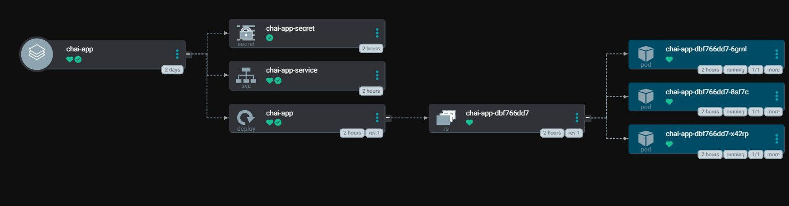
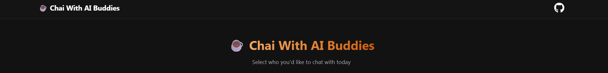
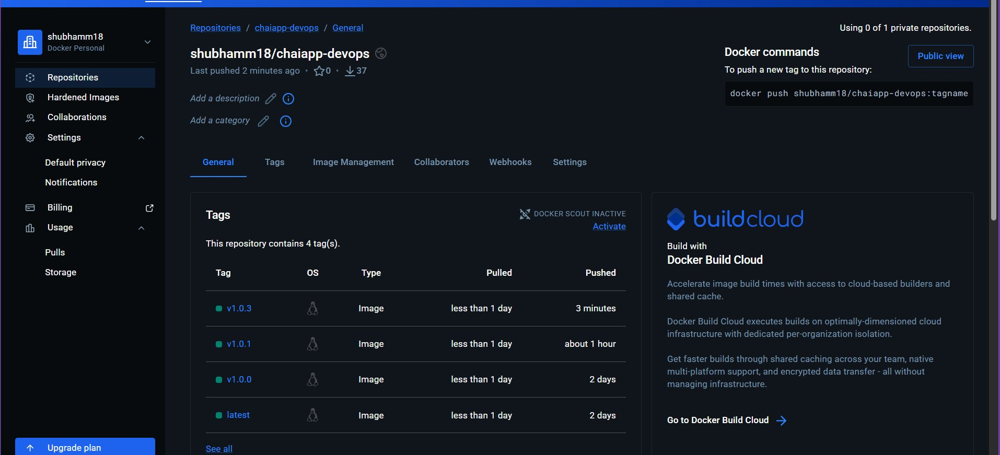

# Chapter 7 - Argo CD Image Updater

ArgoCD Image Updater watches your Docker Hub repo for new image tags and automatically commits the updated tag back to Git. ArgoCD then picks up that commit and redeploys — no manual YAML changes needed.

---

## 1. What We Are Building

```
docker push v1.0.1
        ↓
Image Updater detects new tag
        ↓
commits tag update to GitHub
        ↓
ArgoCD syncs
        ↓
new pods running ✅
```

---

## 2. Before You Start

**Write-back mode**

Image Updater has two ways to save the updated tag:

| Mode | What happens |
|------|-------------|
| `git` | commits the new tag to your GitHub repo — Git stays source of truth ✅ |
| `argocd` | patches the ArgoCD Application object directly in the cluster — nothing recorded in Git ❌ |

Always use `git`. The `argocd` mode defeats the whole point of GitOps.

**Why semver tags, not `:latest`**

`:latest` gets overwritten on every push. Image Updater has no way to detect whether `:latest` changed or not — it just sees the same tag name. Use versioned tags: `v1.0.0`, `v1.0.1`, `v1.0.2`.

`allow-tags: regexp:^v.*` in the annotation means only tags starting with `v` are considered. Tags like `latest`, `main`, `dev` are ignored completely.

**Why Kustomize is needed**

Image Updater only processes apps with Kustomize or Helm as the source type. If your app is using plain Directory (just a folder of YAMLs with no `kustomization.yml`), Image Updater will silently skip it — `images_skipped=1` in logs, no error.

**What file actually gets changed**

Not `deployment.yml`. Image Updater creates this override file:

```
practicals/chaiapp-manifests/.argocd-source-chai-app.yaml
```

```yaml
kustomize:
  images:
  - shubhamm18/chaiapp-devops:v1.0.3
```

Kustomize applies this on top of your `deployment.yml` at render time. Your original `deployment.yml` stays untouched — this is by design.

**The alias must match the container name**

The annotation `chai-app=shubhamm18/chaiapp-devops` — the part before `=` is the alias. It must exactly match the container name in `deployment.yml`. If it doesn't, Image Updater tracks the image but the update never applies.

---

## 3. Prerequisites

- Kind cluster running
- ArgoCD installed in `argocd` namespace
- `kubectl` configured
- ArgoCD CLI installed and logged in
- GitHub repo: `https://github.com/shubhamx18/argocd-gitops.git`
- GitHub PAT with `repo` scope
- Docker Hub account

---

## 4. Install Image Updater

```bash
kubectl apply -n argocd -f \
  https://raw.githubusercontent.com/argoproj-labs/argocd-image-updater/v0.14.0/manifests/install.yaml
```

> Use `v0.14.0` — the `stable` URL gives 404.

Check it's running:

```bash
kubectl -n argocd get pods -l app.kubernetes.io/name=argocd-image-updater
```

```
NAME                                    READY   STATUS    RESTARTS
argocd-image-updater-xxxxxxxxx-xxxxx    1/1     Running   0
```

---

## 5. Push Your Image to Docker Hub

```bash
docker login

docker tag shubhamm18/chaiapp-devops:latest shubhamm18/chaiapp-devops:v1.0.0

docker push shubhamm18/chaiapp-devops:v1.0.0
```

> Always push a versioned tag alongside `:latest`. Image Updater won't track `:latest`.

---

## 6. Create Git Credentials Secret

Image Updater needs to push commits to your GitHub repo. Give it a secret with your PAT.

File: `image-updater/secret.yml`

```yaml
apiVersion: v1
kind: Secret
metadata:
  name: argocd-image-updater-git-creds
  namespace: argocd
stringData:
  username: "shubhamx18"
  password: "<your-github-pat>"
```

```bash
kubectl apply -f image-updater/secret.yml
```

> Never commit this file with a real token. Add it to `.gitignore`.

If you need to rotate the token:

```bash
kubectl create secret generic argocd-image-updater-git-creds \
  -n argocd \
  --from-literal=username=shubhamx18 \
  --from-literal=password=<new-token> \
  --dry-run=client -o yaml | kubectl apply -f -
```

---

## 7. Add Your Repo to ArgoCD

Image Updater reuses ArgoCD's registered repo credentials to push the git commit. If your repo isn't registered here, Image Updater finds the new tag, prepares the commit, then fails at the push step — with no obvious error message in the logs.

```bash
kubectl port-forward svc/argocd-server -n argocd 8080:443 &

argocd login localhost:8080 --insecure

argocd repo add https://github.com/shubhamx18/argocd-gitops.git \
  --username shubhamx18 \
  --password <your-github-pat>
```

Confirm it was added:

```bash
argocd repo list
```

The status must show `Successful` before you move on.

---

## 8. Apply the chai-app Application

File: `image-updater/chaiapp-application.yml`

```yaml
apiVersion: argoproj.io/v1alpha1
kind: Application
metadata:
  name: chai-app
  namespace: argocd
  annotations:
    # alias must match the container name in deployment.yml
    argocd-image-updater.argoproj.io/image-list: chai-app=shubhamm18/chaiapp-devops

    # push the updated tag back to Git
    argocd-image-updater.argoproj.io/write-back-method: git:secret:argocd/argocd-image-updater-git-creds

    # semver: won't jump v1.x.x → v2.0.0 accidentally
    argocd-image-updater.argoproj.io/chai-app.update-strategy: semver

    # only track tags that start with v
    argocd-image-updater.argoproj.io/chai-app.allow-tags: regexp:^v.*

spec:
  project: default
  source:
    repoURL: https://github.com/shubhamx18/argocd-gitops.git
    targetRevision: main
    path: practicals/chaiapp-manifests
  destination:
    server: https://kubernetes.default.svc
    namespace: default
  syncPolicy:
    automated:
      prune: true
      selfHeal: true
```

```bash
kubectl apply -f image-updater/chaiapp-application.yml
```

ArgoCD UI should show `chai-app` healthy with 3 pods:



Port forward and open the app:

```bash
kubectl port-forward svc/chai-app-service 3000:3000 --address=0.0.0.0 &
```

Open `http://<instance-ip>:3000`:



---

## 9. Test the Auto-Update

Push a new tag:

```bash
docker tag shubhamm18/chaiapp-devops:v1.0.0 shubhamm18/chaiapp-devops:v1.0.1
docker push shubhamm18/chaiapp-devops:v1.0.1
```

Image Updater checks every 2 minutes. Watch the logs:

```bash
kubectl -n argocd logs deploy/argocd-image-updater -f
```

When it works you'll see:

```
level=info msg="Setting new image to shubhamm18/chaiapp-devops:v1.0.1"
level=info msg="Committing 1 parameter update(s) for application chai-app"
level=info msg="git push origin main"
level=info msg="Successfully updated the live application spec"
level=info msg="images_updated=1 errors=0"
```

ArgoCD picks up the commit and rolls out the new pods automatically.

---

## 10. How to Verify Everything Worked

**Docker Hub** — new tag should be visible:



**Image Updater logs** — look for `images_updated=1 errors=0`:

```bash
kubectl -n argocd logs deploy/argocd-image-updater | tail -20
```

**GitHub** — there should be a new commit by `argocd-image-updater` in your repo

**The override file** — check this, not `deployment.yml`:

```bash
cat practicals/chaiapp-manifests/.argocd-source-chai-app.yaml
```

```yaml
kustomize:
  images:
  - shubhamm18/chaiapp-devops:v1.0.3
```

**Running pod**:

```bash
kubectl describe pod -n default -l app=chai-app | grep Image:
```

```
Image: shubhamm18/chaiapp-devops:v1.0.3
```

---

## 11. Troubleshooting

### images_updated=0 every cycle

Image Updater only upgrades — it won't downgrade or re-apply the same tag. If your running app is already on the latest semver tag in Docker Hub, there's nothing to update. Push a higher version — if you're on `v1.0.1`, push `v1.0.2`.

---

### Warning: "latest" strategy renamed to "newest-build"

```
level=warning msg="\"latest\" strategy has been renamed to \"newest-build\""
```

You have `update-strategy: latest` in your annotation. Switch to `semver` (recommended) or `newest-build`:

```yaml
argocd-image-updater.argoproj.io/chai-app.update-strategy: semver
```

---

### No commit appearing in GitHub

First check the repo is registered:

```bash
argocd repo list
```

If empty, run `argocd repo add` from Step 7. If the repo is there but commits still aren't appearing, your PAT is likely expired or missing `repo` scope — rotate it using the secret update command from Step 6.

---

### deployment.yml is not changing

It won't — ever. Image Updater writes to `.argocd-source-chai-app.yaml` as a Kustomize override. `deployment.yml` stays untouched. This is expected, not a bug.

---

### Image Updater ignoring your app completely

Your app is using Directory source type. Add a `kustomization.yml` to `practicals/chaiapp-manifests/`:

```yaml
apiVersion: kustomize.config.k8s.io/v1beta1
kind: Kustomization
resources:
  - deployment.yml
  - service.yml
  - secret.yml
```

Without this, Image Updater logs will show `images_skipped=1` and move on with no explanation.

---

*Read More: [ArgoCD Image Updater](https://argocd-image-updater.readthedocs.io/en/stable/)*

*Happy Learning!*
