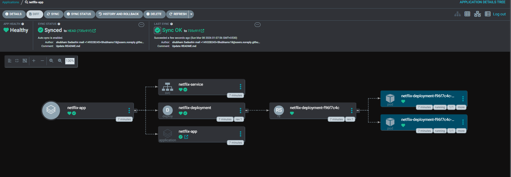

# Netflix Deployment with ArgoCD

Declarative GitOps deployment of Netflix clone using ArgoCD `Application` CRD.



---

## 📁 Folder Structure

```
netflix-manifests/
├── deployment.yaml
├── service.yaml
└── application.yaml
```

---

## Deploy

Clone the repo and navigate to the folder:

```bash
git clone https://github.com/Shubhamx18/argocd-gitops.git
cd argocd-gitops/practicals/netflix-manifests
```

Apply the ArgoCD Application manifest:

```bash
kubectl apply -f application.yaml
```

Or directly point to the file path without navigating:

```bash
kubectl apply -f practicals/netflix-manifests/application.yaml
```

ArgoCD picks it up and deploys `deployment.yaml` and `service.yaml` automatically.

> You can run this from your laptop, EC2, or anywhere that has `kubectl` access to the cluster.
> Only requirement — `kubectl` is connected to your cluster and ArgoCD is installed.

> **Local** — `destination.server` use `https://kubernetes.default.svc`
>
> **EC2** — `destination.server` use your actual cluster URL. To get it run:
> ```bash
> argocd cluster list
> ```
> Then replace in `application.yaml`:
> ```yaml
> destination:
>   server: https://<YOUR-CLUSTER-IP>:<PORT>  # from argocd cluster list
> ```

---

## Verify

```bash
kubectl get pods
kubectl get svc
```

---

## Access the Application

**Local:**

```bash
kubectl port-forward svc/netflix-service 3000:3000
```

Open `http://localhost:3000`

**EC2:**

```bash
kubectl port-forward svc/netflix-service 3000:3000 --address 0.0.0.0
```

Open `http://<EC2-PUBLIC-IP>:3000`

> Make sure port `3000` is open in EC2 Security Group inbound rules.
