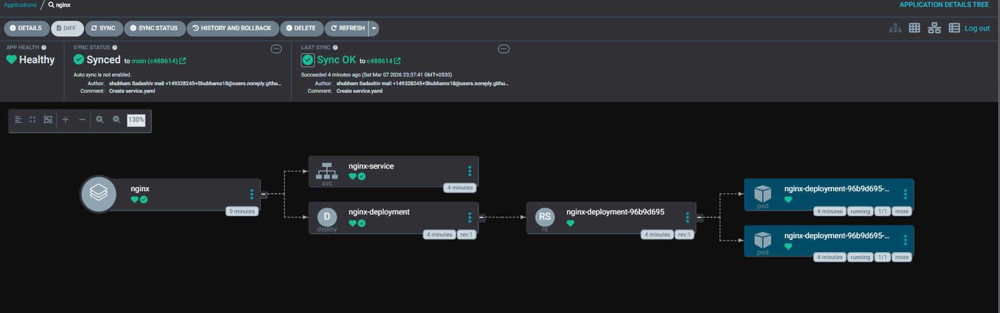

# Nginx GitOps Deployment with ArgoCD — Declarative Approach (UI & CLI)

> 📌 **Declarative = You describe the desired state in YAML, push to Git, and ArgoCD handles the rest.**  
> No manual `kubectl apply`. No running commands every time. Git is the single source of truth.

```
📝 Write YAML  →  ⬆️ Push to Git  →  👁️ ArgoCD watches  →  ✅ Cluster matches Git
```



---

## 📁 Repository Structure

```
argocd-gitops/
└── practicals/
    └── nginx-manifests/
        ├── deployment.yaml
        └── service.yaml
```

---

## 🖥️ Method 1 — ArgoCD UI (Manual Sync)

### 1. Create the Application

Open the ArgoCD UI and click **NEW APP**, then fill in:

**General**

| Field            | Value     |
|------------------|-----------|
| Application Name | `nginx`   |
| Project          | `default` |
| Sync Policy      | `Manual`  |

**Source**

| Field          | Value                                              |
|----------------|----------------------------------------------------|
| Repository URL | `https://github.com/Shubhamx18/argocd-gitops.git` |
| Revision       | `HEAD`                                             |
| Path           | `practicals/nginx-manifests`                       |

**Destination**

| Field     | Value                            |
|-----------|----------------------------------|
| Cluster   | `https://kubernetes.default.svc` |
| Namespace | `default`                        |

Click **Create**.

### 2. Sync the Application

Click **SYNC** → **SYNCHRONIZE** in the ArgoCD UI.

### 3. Verify the Deployment

```bash
kubectl get pods
kubectl get svc
```

### 4. Access the Application

```bash
kubectl port-forward svc/nginx-service 8081:80
```

Open `http://localhost:8081`

> **On EC2?** Use `http://<EC2-PUBLIC-IP>:8081` instead and make sure port `8081` is open in your EC2 Security Group inbound rules.

---

## ⚡ Method 2 — ArgoCD CLI (Automated GitOps)

### 1. Login

```bash
argocd login localhost:8080
```

> **On EC2?** Replace `localhost` with your EC2 public IP — `argocd login <EC2-PUBLIC-IP>:8080` and open port `8080` in Security Group.

```
Username: admin
Password: <admin password>
```

### 2. Create Application

```bash
argocd app create nginx-app \
  --repo https://github.com/Shubhamx18/argocd-gitops.git \
  --path practicals/nginx-manifests \
  --dest-server https://kubernetes.default.svc \
  --dest-namespace default \
  --sync-policy automated \
  --self-heal \
  --auto-prune
```

| Flag | What it does |
|------|--------------|
| `--sync-policy automated` | Auto syncs on every GitHub push |
| `--self-heal` | Restores any manually changed/deleted resource |
| `--auto-prune` | Removes resources deleted from GitHub |

### 3. Check Application

```bash
argocd app list
argocd app get nginx-app
```

### 4. Verify Deployment

```bash
kubectl get pods
```

---

## 🧪 Testing GitOps

### Self-Healing Test

Delete a pod manually — Kubernetes brings it back via the Deployment:

```bash
kubectl delete pod <pod-name>
kubectl get pods
```

### Drift Detection Test

Delete the entire Deployment — ArgoCD restores it automatically via `--self-heal`:

```bash
kubectl delete deployment nginx-deployment
kubectl get deployment
```

> Git is the single source of truth. Any drift from it gets auto-corrected.
